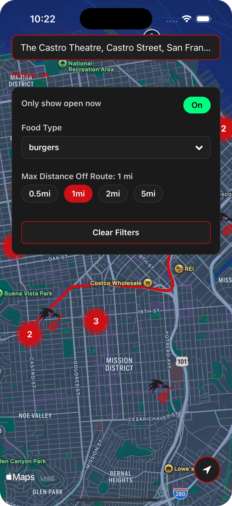

# RAVN — Food when you need it, where you need it.

**RAVN** is a sleek and minimal mobile app built with React Native that helps users discover food spots either *near their current location* (for when you need food right now)  or *along a driving route* (so you don't need to go backwards when your destination is forwards...and you're STARVING). 

The app is powered by the **Google Places API**, with custom filtering, map integration, clustering, and clean, dark UI vibes. No accounts, no storage — just straight-up food discovery.

---

## Features

### Nearby View

  
  

- Discover restaurants near your current location
- Filter by:
  - Whether they're open
  - Price range
  - Distance (in miles)
- Pull-to-refresh with haptic feedback
- Ratings, pricing, open status, and distance badges
- Taps open native map apps with directions

### Route View

  
  
  
  
  

- Enter a destination and find restaurants *along the way*
- Filter by:
  - Type of food (e.g., tacos, ramen, pizza)
  - Distance off your route
  - Whether they’re open now
- Clustered pin markers to reduce map clutter
- Tap a restaurant marker for:
  - Photo preview (if available)
  - Name, rating, price, open status, address
  - One-tap button to open directions
- Fully animated filters dropdown

---

## Tech Stack

- [React Native](https://reactnative.dev/)
- [Expo](https://expo.dev/)
- [react-native-maps](https://github.com/react-native-maps/react-native-maps)
- [react-native-map-clustering](https://github.com/venits/react-native-map-clustering)
- [Google Places & Directions API](https://developers.google.com/maps/documentation/places/web-service/overview)
- [Expo Location](https://docs.expo.dev/versions/latest/sdk/location/)
- [React Navigation](https://reactnavigation.org/)

&copy; 2025 BaileyKH. All rights reserved.

